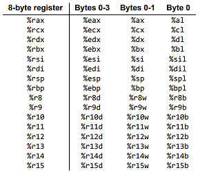

# Exercice 1

Combien l’architecture x86-64 a-t-elle de registres ? 

[source](https://cs.brown.edu/courses/cs033/docs/guides/x64_cheatsheet.pdf)




Quel est le format d’adressage sur cette architecture ?

```
Format 64 bits.
```

Quelle est la sémantique des instructions movq, leaq, pushq, popq, call, ret, subq, j, je, leave et cmp ?

```
Instruction         Description
movq S, D           Move S into D
leaq S, D           Load effective address of source into destination
pushq S             Push onto stack
popq D              Pop from stack
call Label          Push return address and jump to label
call *Operand       Push return address and jump to specified location
ret                 Pop return address from stack and jump there
subq S, D           Subtract source from destination
je / jz Label       Jump if equal/zero 
leave               Set %rsp to %rbp, then pop top of stack into %rbp
cmp S2, S1          Set condition codes according to S1 - S2
```

Est-ce qu’il s’agit d’une architecture little endian ou big endian ?
[source](https://fr.wikipedia.org/wiki/Endianness#Dans_les_syst%C3%A8mes_d'exploitation_(par_architectures))
```
Little-endian
```
Quelles sont les conventions d’appel de l’architecture x86-64/System V
[source](https://en.wikipedia.org/wiki/X86_calling_conventions#List_of_x86_calling_conventions)
```
vectorcall et autre
```

```
```

```
```

```
```